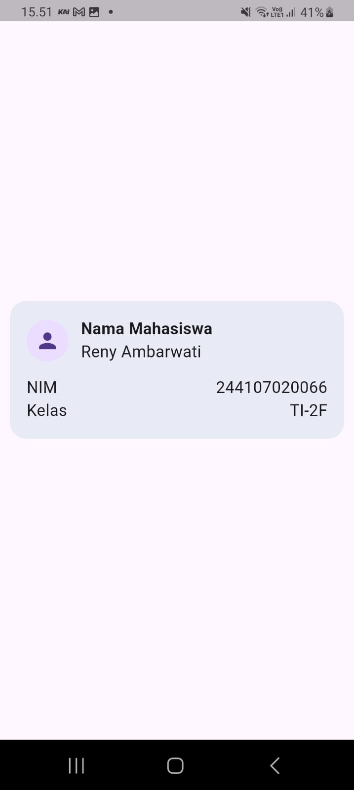

# Praktikum Week 2 — Declarative UI & Responsive Design

**Nama:** Reny Ambarwati
**Program Studi:** Sarjana Terapan Teknik Informatika
**NIM:** 244207020066

## 1. Praktikum Dasar Layout
Eksperimen yang dilakukan:

* Menghapus `Expanded` dan mengamati perubahan layout.
* Mengubah `MainAxisSize.min` menjadi default dan mengamati tinggi card.
* Menambahkan informasi email menggunakan `Row` dan `Expanded`.

 


## 2. Responsive Academic Dashboard

Dashboard dibuat dengan tampilan **Academic Overview** yang terdiri dari profile mahasiswa dan empat information card:

* Assignments: 8
* Attendance: 92%
* Portfolio: Ready
* Current Week: 02

Responsive layout dibuat menggunakan `LayoutBuilder` dan `GridView`.

Breakpoint yang digunakan:

```dart
const double kWideBreakpoint = 700;
```

Hasilnya:

* Layar `< 700 px` → 1 kolom
* Layar `>= 700 px` → 2 kolom

Dengan demikian tampilan dashboard dapat menyesuaikan ukuran layar.

---

## 3. Theme dan Interaksi

Aplikasi menggunakan `StatefulWidget` untuk mengatur perubahan theme.

Tersedia:

* Light Mode
* Dark Mode

Perubahan theme dilakukan menggunakan `CupertinoSwitch`.

Selain itu, `Semantics` digunakan pada informasi penting dan tombol theme untuk mendukung accessibility.

---

## 4. AI Design Exploration

## 🎨 Prompt 1 — Perbandingan Layout GridView vs LayoutBuilder + Column

### Prompt yang Diajukan

```
Bandingkan dua tata letak dashboard akademik untuk Flutter: versi GridView
dan versi LayoutBuilder + Column. Jelaskan trade-off responsif dan
aksesibilitasnya.
```

### Output AI — Perbandingan Layout

#### A. Versi Pure GridView

```dart
GridView.count(
  crossAxisCount: 2, // selalu 2 kolom, tidak peduli ukuran layar
  crossAxisSpacing: 16,
  mainAxisSpacing: 16,
  childAspectRatio: 2.6,
  children: const [
    InfoCard(title: 'Assignments', value: '8'),
    InfoCard(title: 'Attendance', value: '92%'),
    InfoCard(title: 'Portfolio', value: 'Ready'),
    InfoCard(title: 'Current Week', value: '02'),
  ],
)
```

| Aspek | Nilai | Keterangan |
|-------|-------|-----------|
| **Responsif** | Buruk | `crossAxisCount` hardcoded, tidak berubah di layar kecil |
| **Aksesibilitas** | Cukup | Kartu kecil di layar sempit membuat teks sulit dibaca |
| **Kode** | Singkat | Sedikit boilerplate |
| **Kontrol Layout** | Terbatas | `childAspectRatio` sulit diprediksi di semua layar |
| **Performa** | Baik | Lazy loading item (untuk list panjang) |

**Masalah utama:**
- Di layar < 400px (mis. Galaxy A03), dua kolom terlalu sempit — teks terpotong
- `childAspectRatio` yang tidak tepat menyebabkan overflow vertikal
- Tidak ada adaptasi untuk orientasi landscape vs portrait

---

#### B. Versi LayoutBuilder + Column + GridView Dinamis ← DIREKOMENDASIKAN

Implementasi sesuai kode saat ini `main.dart`:

```dart
body: LayoutBuilder(
  builder: (context, constraints) {
    // Breakpoint: 700px -> 2 kolom, <700px -> 1 kolom
    final columns = constraints.maxWidth >= kWideBreakpoint ? 2 : 1;

    return SingleChildScrollView(
      padding: const EdgeInsets.all(16),
      child: Column(
        crossAxisAlignment: CrossAxisAlignment.start,
        children: [
          const ProfileHeader(),
          const SizedBox(height: 20),
          GridView.count(
            shrinkWrap: true,
            physics: const NeverScrollableScrollPhysics(),
            crossAxisCount: columns,    // dinamis berdasarkan lebar
            crossAxisSpacing: 16,
            mainAxisSpacing: 16,
            childAspectRatio: 2.6,
            children: const [...],
          ),
        ],
      ),
    );
  },
),
```

| Aspek | Nilai | Keterangan |
|-------|-------|-----------|
| **Responsif** | Baik | Breakpoint 700px — jumlah kolom menyesuaikan |
| **Aksesibilitas** | Baik | 1 kolom di layar sempit = target touch lebih besar |
| **Kode** | Sedang | Sedikit lebih verbose, tapi lebih fleksibel |
| **Kontrol Layout** | Penuh | Bisa atur logika kompleks di `builder` callback |
| **Performa** | Perlu perhatian | `shrinkWrap: true` matikan lazy-loading |

### Trade-off Ringkasan

| Kriteria | Pure GridView | LayoutBuilder + Column |
|----------|--------------|------------------------|
| Responsif < 600px | Kolom tetap 2 | Otomatis 1 kolom |
| Aksesibilitas | Target touch kecil | Target touch lebih besar |
| Kompleksitas kode | Minimal | Lebih banyak nesting |
| Lazy loading | Ya (default) | Tidak (shrinkWrap: true) |
| Kontrol layout | Terbatas | Penuh |
| Breakpoint kustom | Tidak bisa | Bisa atur bebas |

### Keputusan: LayoutBuilder + Column + GridView Dinamis

**Alasan teknis:**
1. Dashboard akademik memiliki konten fixed (tidak ribuan item) → `shrinkWrap: true` aman
2. Breakpoint 700px membuat layout nyaman di HP, tablet, dan desktop
3. Aksesibilitas lebih baik: kartu full-width di layar sempit memiliki hit-test area lebih besar
4. `SingleChildScrollView` wrapping `Column` memberikan scrollability tanpa nested scroll conflict

---

## 💡 Prompt 2 — Expanded Overflow di Dalam Row

### Prompt yang Diajukan

```
Jelaskan kapan penggunaan Expanded justru menyebabkan overflow di dalam Row,
beri contoh kode yang gagal dan perbaikannya.
```

### Output AI — Penjelasan Konsep

`Expanded` memberikan constraint **tight** kepada child-nya — artinya child **wajib** mengisi ruang yang diberikan. Masalah terjadi ketika:

1. `Expanded` di dalam widget tanpa bounded constraint (Column tak-terbatas, ListView, dll.)
2. Row di dalam Row, dan Expanded di Row terluar tidak dibatasi
3. `Expanded` membungkus widget yang punya intrinsic size lebih besar dari slot-nya

---

#### Kode yang GAGAL — Contoh 1: Expanded dalam Column tanpa bounded height

```dart
// GAGAL: Column di dalam Column tanpa Expanded/Flexible
Column(
  children: [
    Row(
      children: [
        Expanded(          // ini yang jadi masalah
          child: Column(  // Column anak punya unbounded height
            children: [
              Text('Item 1'),
              Text('Item 2'),
              Text('Item 3'),
            ],
          ),
        ),
      ],
    ),
  ],
)
// ERROR: RenderFlex children have non-zero flex but incoming height constraints are unbounded.
```

**Penyebab:** `Column` luar tidak tahu tingginya (unbounded), lalu `Expanded` di `Row` memberikan constraint tight ke `Column` dalam, tapi Column dalam minta unbounded height → konflik constraint.

---

#### Kode yang GAGAL — Contoh 2: Widget lain habiskan semua ruang Row

```dart
// GAGAL: total width Container sudah melebihi lebar layar
Column(
  crossAxisAlignment: CrossAxisAlignment.start,
  children: [
    Row(
      children: [
        Container(width: 200, child: Text('Label sangat panjang sekali')),
        Container(width: 200, child: Text('Konten juga panjang')),
        Expanded(        // harapkan sisa ruang, tapi sudah habis
          child: Text('Overflow!'),
        ),
      ],
    ),
  ],
)
// ERROR: A RenderFlex overflowed by X pixels on the right.
```

---

#### Kode yang GAGAL — Contoh 3: Expanded dalam ListView (unbounded)

```dart
// GAGAL: ListView punya unbounded height constraint
ListView(
  children: [
    Row(
      children: [
        Expanded(
          child: Container(
            height: double.infinity, // infinity dalam unbounded = ERROR
            color: Colors.blue,
          ),
        ),
      ],
    ),
  ],
)
// ERROR: BoxConstraints forces an infinite height.
```

---

#### Perbaikan — Contoh 1: Gunakan Flexible + mainAxisSize.min

```dart
// PERBAIKAN: Gunakan Flexible (tidak-tight)
Column(
  children: [
    Row(
      crossAxisAlignment: CrossAxisAlignment.start,
      children: [
        Flexible(           // Flexible, bukan Expanded
          child: Column(
            mainAxisSize: MainAxisSize.min,  // tambahkan ini!
            children: [
              Text('Item 1'),
              Text('Item 2'),
              Text('Item 3'),
            ],
          ),
        ),
      ],
    ),
  ],
)
```

**Perbedaan `Expanded` vs `Flexible`:**
- `Expanded` = `Flexible(fit: FlexFit.tight)` → child **wajib** isi seluruh ruang
- `Flexible` = `Flexible(fit: FlexFit.loose)` → child boleh lebih kecil dari slot

---

#### Perbaikan — Contoh 2: Gunakan flex proportional

```dart
// PERBAIKAN: Beri semua item flex, sehingga total = 100% lebar Row
Column(
  crossAxisAlignment: CrossAxisAlignment.start,
  children: [
    Row(
      children: [
        Expanded(flex: 2, child: Text('Label')),
        Expanded(flex: 2, child: Text('Konten')),
        Expanded(flex: 1, child: Text('Sisa')),
      ],
    ),
  ],
)
```

---

#### Perbaikan — Contoh 3: Beri bounded height pada ListView

```dart
// PERBAIKAN: Bungkus ListView dengan SizedBox ber-height konkret
SizedBox(
  height: 300,  // bounded!
  child: ListView(
    children: [
      Row(
        children: [
          Expanded(
            child: Container(
              height: 100,   // konkret, bukan infinity
              color: Colors.blue,
            ),
          ),
        ],
      ),
    ],
  ),
)
```

---

#### Relevansi dengan Kode Proyek Ini

Dalam `lib/main.dart` baris 176 dan 237, `Expanded` digunakan dengan benar:

```dart
// BENAR: Expanded di dalam Row yang punya bounded width (dari Scaffold)
Row(
  children: [
    CircleAvatar(...),
    const SizedBox(width: 16),
    Expanded(          // aman: Row ada di dalam Scaffold (bounded)
      child: Column(
        mainAxisSize: MainAxisSize.min,  // Column tidak paksa infinite height
        children: [...],
      ),
    ),
  ],
)
```

**Mengapa aman:** `Scaffold` memberikan `BoxConstraints` bounded ke `body`. `LayoutBuilder` → `Column` → `Row` semuanya mendapat bounded width. `Expanded` hanya mengambil sisa horizontal space.

---

## 🔍 Prompt 3 — Verification: Audit Mandiri AI

### Prompt yang Diajukan

```
Periksa kembali rekomendasi layout di atas: apakah tetap responsif di
bawah 600px, apakah mengurangi aksesibilitas, dan apakah ada widget
yang tidak tersedia di Flutter stabil saat ini?
```

### Output AI — Hasil Audit

#### Audit 1: Responsif di Bawah 600px

**Breakpoint saat ini:** `kWideBreakpoint = 700` di `main.dart` baris 4.

| Lebar Layar | Kolom | Status |
|-------------|-------|--------|
| 320px (iPhone SE) | 1 kolom | OK |
| 360px (Galaxy A) | 1 kolom | OK |
| 414px (iPhone Plus) | 1 kolom | OK |
| 600px (tablet kecil) | 1 kolom | OK |
| 700px (breakpoint) | 2 kolom | OK |
| 768px (iPad) | 2 kolom | OK |

**Kesimpulan:** Responsif. Layout single-column aktif di semua layar < 700px.

**Catatan kritis:** `childAspectRatio: 2.6` masih perlu diuji di layar sangat sempit. Di layar 320px dengan 1 kolom, kartu akan beraspek `320 * (320/2.6) ≈ 123px` tingginya — cukup. Namun teks `headlineSmall` pada InfoCard bisa jadi terlalu besar; tambahkan `overflow: TextOverflow.ellipsis` sebagai safety net.

---

#### Audit 2: Dampak terhadap Aksesibilitas

| Widget | Semantics Label | Status |
|--------|----------------|--------|
| `CupertinoSwitch` (toggle dark) | `"Ubah tema aplikasi"` | Ada |
| `ProfileHeader` | `"Profil mahasiswa"` | Ada |
| `InfoCard` | `"$title: $value"` (mis. "Assignments: 8") | Ada |
| Dark mode icon | `"Mode gelap/terang aktif"` | Ada |

**Semua elemen interaktif dan informatif memiliki label semantik.**

**Rekomendasi tambahan:**

```dart
// Tambahkan liveRegion pada InfoCard untuk screen reader lebih informatif
Semantics(
  label: '$title: $value',
  liveRegion: true,   // beri tahu screen reader jika value berubah dinamis
  child: Card(...),
)
```

---

#### Audit 3: Ketersediaan Widget di Flutter Stabil

| Widget / Property | Tersedia di Flutter Stabil? | Keterangan |
|------------------|----------------------------|-----------|
| `LayoutBuilder` | Ya | Core widget, tersedia sejak lama |
| `GridView.count` | Ya | Core widget |
| `SingleChildScrollView` | Ya | Core widget |
| `Semantics` | Ya | Core accessibility widget |
| `ThemeData(useMaterial3: true)` | Ya | Tersedia sejak Flutter 3.0 |
| `colorScheme.surfaceContainerHighest` | Ya (perlu 3.10+) | Material 3 color token |
| `CupertinoSwitch` | Ya | `package:flutter/cupertino.dart` |
| `colorSchemeSeed` | Ya | Tersedia sejak Flutter 3.0 |
| `ThemeMode.dark` | Ya | Core widget |


## 🏆 Keputusan Teknis Final

### Arsitektur Layout yang Dipilih

```
Scaffold
└── LayoutBuilder (membaca constraints.maxWidth)
    └── SingleChildScrollView
        └── Column
            ├── ProfileHeader (Row + Expanded — selalu full-width)
            └── GridView.count (crossAxisCount = 1 atau 2 berdasar breakpoint 700px)
                └── InfoCard x4 (Row + Expanded untuk title)
```

### Alasan Teknis

1. **`LayoutBuilder` lebih reliable dari `MediaQuery.of(context).size`** karena membaca constraint aktual widget, bukan ukuran layar keseluruhan (penting untuk multi-window / foldable).
2. **Breakpoint 700px** dipilih karena mayoritas HP Android < 700px lebar, sementara tablet mulai ≥ 700px — layout 2 kolom lebih cocok untuk tablet.
3. **`shrinkWrap: true` + `NeverScrollableScrollPhysics()`** pada GridView aman karena item fixed (4 item) dan sudah dibungkus `SingleChildScrollView`.
4. **`Expanded` di `ProfileHeader`** digunakan dengan benar karena berada di `Row` yang memiliki bounded width dari Scaffold.
5. **Semua `Semantics` label** memastikan kompatibilitas dengan TalkBack (Android) dan VoiceOver (iOS).

## 5. Refactoring

### Reusable Widget

Information card dibuat menjadi widget `InfoCard`:

```dart
const InfoCard(
  title: 'Assignments',
  value: '8',
)
```

### Theme

Warna dan typography menggunakan:

```dart
Theme.of(context)
```

sehingga dapat mengikuti light maupun dark theme.

### Breakpoint

Breakpoint dibuat dalam satu konstanta:

```dart
const double kWideBreakpoint = 700;
```

---

## 6. Widget Testing

Responsive layout diuji menggunakan dua ukuran layar.

### Layar sempit

```text
400 × 800
```

Dashboard diuji untuk memastikan card tetap ditampilkan dan memiliki ukuran yang sesuai.

### Layar lebar

```text
1200 × 800
```

Dashboard diuji untuk memastikan layout berubah menjadi dua kolom.

Testing dijalankan menggunakan:

```bash
flutter test
```

Static analysis dijalankan menggunakan:

```bash
flutter analyze
```

## 7. Refleksi

### Apa perbedaan cara berpikir imperative dan declarative saat membangun UI?

Pada imperative UI, developer menentukan langkah-langkah untuk mengubah tampilan UI.

Pada declarative UI, developer mendeskripsikan tampilan berdasarkan state saat ini. Ketika state berubah, Flutter akan membangun kembali UI yang sesuai.

Dalam praktikum ini, contohnya adalah perubahan theme:

themeMode: isDark
    ? ThemeMode.dark
    : ThemeMode.light,

Ketika isDark berubah, tampilan aplikasi ikut berubah tanpa harus mengubah setiap komponen secara manual.

### Kapan Expanded membantu?

Expanded membantu ketika child harus menggunakan ruang yang tersisa dalam Row atau Column.

Namun Expanded dapat menyebabkan layout error ketika digunakan pada parent yang memberikan constraint tidak terbatas pada arah utama.

### Bagaimana breakpoint dan theme memengaruhi UX?

Breakpoint memungkinkan aplikasi menyesuaikan struktur layout dengan ukuran layar.

Pada layar kecil, satu kolom membuat informasi lebih mudah dibaca.

Pada layar besar, dua kolom dapat menggunakan ruang layar dengan lebih efisien.

Theme juga memengaruhi kenyamanan pengguna. Light mode cocok untuk kondisi terang, sedangkan dark mode dapat memberikan tampilan yang lebih nyaman pada kondisi tertentu.

### Apa yang diverifikasi dari rekomendasi AI?

Rekomendasi AI tidak langsung digunakan tanpa pengujian.

Hal yang diverifikasi:

1. Responsiveness pada ukuran layar berbeda.
2. Penggunaan Expanded.
3. Penggunaan LayoutBuilder.
4. Penggunaan GridView.
5. Accessibility menggunakan Semantics.
6. Penggunaan CupertinoSwitch.
7. Hasil flutter test.
8. Hasil flutter analyze.

Berdasarkan hasil tersebut, kombinasi LayoutBuilder + GridView dipilih karena paling sesuai dengan kebutuhan dashboard.

## 9. Kesimpulan

Praktikum ini menghasilkan dashboard akademik Flutter yang menerapkan **declarative UI, responsive design, theme switching, accessibility, reusable widget, dan widget testing**.

Dashboard dapat menyesuaikan layout berdasarkan ukuran layar serta mendukung light dan dark mode.


